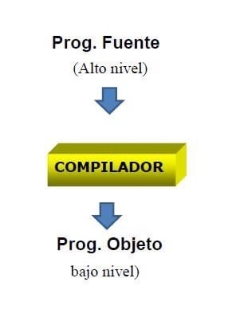

# Introducción

## Traductor (Translator)

* Es un programa que convierten un programa escrito en un lenguaje (lenguaje fuente) a otro lenguaje (lenguaje objeto)
* Ejemplo: programa de lenguaje C a Pascal

  

  

## Ensamblador (Assembler)

* Es un **tipo de traductor** para una máquina en particular, donde el lenguaje fuente es un **lenguaje ensamblador** y el lenguaje objeto es el **código de la máquina**
* Es un traductor sencillo, en el que el lenguaje fuente tiene una estructura tan sencilla que permite la traducción de cada sentencia fuente a una única instrucción en código máquina
* En definitiva, existe una correspondencia uno a uno entre las instrucciones ensamblador y las instrucciones máquina
* Ejemplo: Instrucción ensamblador: LD HL, #0100 -> Código máquina generado: 65h.00h.01h

  | Ventajas | Desventajas |
  | -- | -- |
  | Veloces | Dificil escribir, leer y entender |
  | Exactos | Dependiente de la máquina para la que se ha escrito (rescribir el programa para otra máquina) |

  

## Intérprete (Interpreter)

* Es un **tipo de traductor** de lenguajes
* Lee sentencia por sentencia del programa fuente, la convierte en el código objeto y la ejecuta
* Uno de los motivos de la existencia de programas interpretados es que hay algunos lenguajes de programación que permiten agregar sentencias durante la ejecución, cosa que no se podría hacer si fueran compilados
* Ejemplos: Basic, Python, SmallTalk, Ruby, Javascript, etc.

  

## Compilador (Compiler)

* Es un **tipo de traductor** en el que el lenguaje fuente es un **lenguaje de alto nivel** y el lenguaje objeto es de **bajo nivel**
* Analiza todo el programa fuente, crea el programa objeto y luego permite su ejecución (sólo del programa objeto obtenido)
* Después de compilar un programa, su ejecución es mucho más rápida que la ejecución de un programa interpretado

  

  

  

  | Año | Desarrollador/a | |
  | -- | -- | -- |
  | **1951** | **Grace Hooper** | desarrolla el primer compilador, el A-0. La primera rutina "compilada" se probó con éxito en una máquina UNIVAC |
  | **1954** | **John Backus**  | comenzó el desarrollo de un compilador de FORTRAN para IBM 704, que le llevó dos años y medio y 18 personas para realizarlo |

  

* Los lenguajes compilados tienen como resultado archivos binarios que lee el sistema operativo o directamente el hardware y los ejecuta. Ejemplo C, C++, Pascal, Fortran, COBOL, Go, etc.

  

## Herramientas software necesarias para los compiladores

### Editores (Editors)

* Se utilizan para leer y escribir los programas que posteriormente el compilador traducirá a código máquina
* Actualmente, se integran con los compiladores constituyendo un IDE (entorno de desarrollo interactivo)
* Para que los archivos que generan se puedan leer por cualquier editor, es necesario que tengan formato ASCII

### Preprocesadores (Preprocessors)

* Son programas que funcionan de forma independiente una vez que el compilador lo llama, modificando el programa fuente antes de comenzar el proceso de compilación
* Tareas:
  * Sustituir las macros por las sentencias que las componen
  * Incluir otros archivos o librerías
  * Eliminar comentarios

  

### Enlazadores (Linkers)

* Se encargan de unir los diferentes módulos con sus respectivos códigos objeto para producir un archivo ejecutable
* También sirven para enlazar el código objeto con las funciones que necesita de una librería de funciones u otros módulos (archivos con extensión "lib" o "dll")

  

  

### Cargadores (Loaders)

* Se encargan de asignar las direcciones y el espacio de memoria necesario para la ejecución del programa
* Esto se puede hacer porque el enlazador le proporciona direcciones de memoria relativas, denominándose este tipo de código reubicable o relocalizable, y el cargador le asigna posiciones reales o absolutas
* Es una herramienta que trae el sistema operativo

  

### Depuradores (Debbugers)

* Son herramientas que permiten encontrar errores y solucionarlos en un programa, una vez que ha sido compilado
* Normalmente permiten seleccionar variables y visualizar los valores que van teniendo a partir de una ejecución paso a paso

  

### Desensambladores (Disassemblers)

* Son herramientas que traducen el lenguaje máquina a lenguaje ensamblador
* Se utilizan para realizar ingeniería inversa

### Decompiladores (Decompilers)

* Son herramientas que traducen de código máquina a un lenguaje de alto nivel, como por ejemplo Java, en lugar de traducir a ensamblador, que es lo que hace el desensamblador

### Transpilador

* Son herramientas que leen código fuente escrito en un lenguaje de programación y producen el código equivalente en otro lenguaje o en una versión distinta del mismo, en javascript es común escribir código moderno y usar Babel para dar soporte a navegadores antiguos

  

## ¿Cómo funciona la compilación de Código?

  

## Estructura de un compilador

* Un compilador es un programa complejo que consta de una serie de pasos o fases bien definidas y sistematizadas

* **Etapas del proceso de compilación**:

  | Etapa | |
  | -- | -- |
  | **Análisis** | analiza la entrada y genera estructuras intermedias |
  | **Síntesis** | sintetiza la salida a partir de estructuras intermedias |

  

* **Fases del proceso de compilación**:

  | Fase | | Comienza | Finaliza |
  | -- | -- | -- | -- |
  | **Frontend/Inicial** | agrupa las fases dependientes del lenguaje fuente e independientes de la máquina final | código fuente | código intermedio |
  | **Backend/Final**    | agrupa las fases independientes del lenguaje fuente, pero dependientes del código intermedio y de la máquina de destino | código intermedio | código final |

  

### Tablas de símbolos y de tipos

  | Tablas | Guarda información sobre ... |
  | -- | -- |
  | **Tabla de Símbolos** | variables declaradas, funciones y procedimientos, parámetros y en general cuanta información vaya a ser necesaria para realizar todo el proceso de compilación |
  | **Tabla de Tipos**    | tipos básicos y tipos definidos en el programa a compilar |

### Gestión de errores

* Se realiza durante todas las fases del compilador
* Informa al programador dónde hay errores, de que tipo son, etc.
* Cuanta más información sea capaz de dar al programador (claridad y exactitud), mejor, evitando ralentizar los programas correctos

  

### Analizador léxico (scanner)

* Se comienza a leer la cadena de entrada y los caracteres que se reconocen se agrupan en componentes léxicos (tokens)

### Analizador sintáctico (parser)

* Agrupa los tokens en frases que la gramática del lenguaje reconoce construyendo un árbol sintáctico
* Los dos analizadores suelen trabajar unidos e incluso el léxico suele ser una subrutina del sintáctico

### Analizador semántico

* Identifica el comportamiento (significado), busca errores semánticos, verifica los tipos, determina operadores y operandos
* Utiliza atributos que se agregan al árbol, construyendo así el árbol con anotaciones (o decorado)

### Generador de código intermedio

* Genera código para la máquina objetivo en lenguaje ensamblador
* Cambiando esta parte de síntesis, nos permite tener compiladores para las máquinas que se necesite

### Optimizador

* Se intenta mejorar (reducir el número de instrucciones necesarias para realizar las mismas operaciones) el código intermedio y, por tanto, el código objetivo mediante distintas técnicas

### Generador de código

* Genera el código binario de la máquina objetivo una vez que ha sido optimizado
* Es un proceso mecánico que consiste en ir pasando las distintas instrucciones de CI al lenguaje ensamblador de la máquina que se vaya a utilizar

## Resumen

  

## Cómo se crea un LP

  

## Herramientas y descripciones del lenguaje a crear

1. Definir el lenguaje a crear (para qué lenguaje se va a hacer el compilador)
1. Definir **especificación léxica** (los lexemas que utiliza)
1. Definir **especificación sintáctica** (la ordenación válida de esos lexemas)
1. Definir **especificación semántica** (descripción del significado de cada lexema y las reglas que deben cumplirse)
1. Saber si existe ya un código intermedio que se pueda utilizar o hay que crear uno nuevo y el código final que se utilizará
1. Seleccionar el lenguaje base (lenguaje de implementación del propio compilador) y herramientas compatibles

    

## Diseño del compilador

* A la hora de diseñar un compilador, se utilizan los diagramas de Tombstone:

  
  

## Tipos de Lenguajes

  
