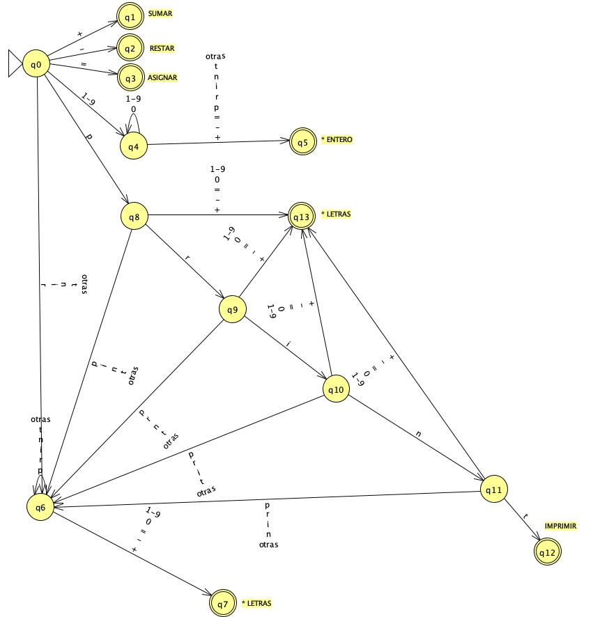

# Scanner

## Ejercicios

1. Diseñar un DT para reconocer los siguientes componentes léxicos:
    * LETRAS: cualquier secuencia de una o más letras
    * ENTERO: cualquier secuencia de uno o más números (si tiene más de un número no deberá comenzar por 0)
    * ASIGNAR: la secuencia =
    * SUMAR: la secuencia +
    * RESTAR: la secuencia -
    * IMPRIMIR: la palabra reservada print

    

    | Q | + | - | = | 0 | 1-9 | p | r | i | n | t | Otras | Token | Retroceso |
    | -- | -- | -- | -- | -- | -- | -- | -- | -- | -- | -- | -- | -- | -- |
    | 0 | 1 | 2 | 3 | error | 4 | 8 | 6 | 6 | 6 | 6 | 6 | - | - |
    | 1 | - | - | - | - | - | - | - | - |- | - | - | SUMAR | 0 |
    | 2 | - | - | - | - | - | - | - | - |- | - | - | RESTAR | 0 |
    | 3 | - | - | - | - | - | - | - | - |- | - | - | ASIGNAR | 0 |
    | 4 | 5 | 5 | 5 | 4 | 4 | 5 | 5 | 5 | 5 | 5 | 5 | - | - |
    | 5 | - | - | - | - | - | - | - | - | - | - | - | ENTERO | 1 |
    | 6 | 7 | 7 | 7 | 7 | 7 | 6 | 6 | 6 | 6 | 6 | 6 | - | - |
    | 7 | - | - | - | - | - | - | - | - | - | - | - | LETRAS | 1 |
    | 8 | 13 | 13 | 13 | 13 | 13 | 6 | 9 | 6 | 6 | 6 | 6 | - | - |
    | 9 | 13 | 13 | 13 | 13 | 13 | 6 | 6 | 10 | 6 | 6 | 6 | - | - |
    | 10 | 13 | 13 | 13 | 13 | 13 | 6 | 6 | 6 | 11 | 6 | 6 | - | - |
    | 11 | 13 | 13 | 13 | 13 | 13 | 6 | 6 | 6 | 6 | 12 | 6 | - | - |
    | 12 | - | - | - | - | - | - | - | - | - | - | - | IMPRIMIR | 0 |
    | 13 | - | - | - | - | - | - | - | - | - | - | - | LETRAS | 1 |

1. Para el lenguaje generado por la expresión regular  (a | b)* abb
    1. Crear el DT
    1. Generar la tabla de transiciones
    1. Escribir un programa en Java para implementar la tabla

    | Q | a | b | Token | Retroceso |
    | -- | -- | -- | -- | -- |
    | 0 | 1 | 4 | - | - |
    | 1 | 1 | 2 | - | - |
    | 2 | 1 | 3 | - | - |
    | 3 | - | - | accept | 0|
    | 4 | 1 | 4 | - | - |

    ```java
    class Lexer {

      static final int ERROR = -1;
      static final int ACEPTAR = 0;
      String palabra;
      int cursor = 0;
      
      Lexer(String palabra) {
        this.palabra = palabra;
      }

      char getCaracter() {
        if (cursor < palabra.length()) {
          return palabra.charAt(cursor++);
        }
        return '*';
      }

      int q0() {
        switch (this.getCaracter()) {
        case 'a‘:  return q1();
        case 'b‘:  return q4();
        default:   return ERROR;
        }
      }

      int q1() {
        switch (this.getCaracter()) {
        case 'a‘:  return q1();
        case 'b‘:  return q2();
        default:   return ERROR;
        }
      }

      int q2() {
        switch (this.getCaracter()) {
        case 'a‘:  return q1();
        case 'b‘:  return q3();
        default:   return ERROR;
        }
      }

      int q3() {
        return ACEPTAR;
      }

      int q4() {
        switch (this.getCaracter()) {
        case 'a‘:  return q1();
        case 'b‘:  return q4();
        default:   return ERROR;
        }
      }  

      public static void main(String[] args) {
        System.out.println(new Lexer("abb").q0());
        System.out.println(new Lexer("aabb").q0());
        System.out.println(new Lexer("babb").q0());
        System.out.println(new Lexer("ababb").q0());
        System.out.println(new Lexer("").q0());
        System.out.println(new Lexer("bb").q0());
      }

    }
    ```

1. Escribir un scanner que sustituya las apariciones de un número par escrito en notación binaria por la cadena “BINARIO_PAR”

      ```plain
      %%
      %class Ejer
      %standalone
      %line
      %column
      BINARIO_PAR = ([0-1]*)0
      BINARIO_NO_PAR = ([0-1]*)1
      %% 
      {BINARIO_PAR} {System.out.print("BINARIO_PAR ");}
      {BINARIO_NO_PAR} {System.out.print(yytext()+" ");}
      (" "|\t|\r)+ {}
      (\n) {System.out.println(" ");}
      ```

1. Escribir un scanner que sustituya las cadenas casa, camisa y carcasa que figuran en un texto por la cadena “CA_SA”

      ```plain
      CA_SA = "ca"("rca"|"mi")?"sa"
      %% 
      {CA_SA} {System.out.print("CA_SA");}
      (\n) {System.out.println(" ");}
      .    {System.out.print(yytext());}
      ```

1. Escribir un scanner que reduzca a un único espacio en blanco todas las secuencias de espacios en blanco y tabuladores de un texto

      ```plain
      ESPACIOS = [" " | \t]+
      %% 
      {ESPACIOS} {System.out.print(" ");}
      (\n) {}
      ```

1. Escribir un scanner que suprima los comentarios de línea de un texto (desde un # hasta el fin de la línea)

      ```plain
      Comentario = #(.)*
      %% 
      {Comentario} {System.out.print("");}
      . {System.out.print(yytext());}
      ```

1. Escribir un scanner que inserte un * delante y detrás de cada carácter + que figura en un texto

      ```plain
      %% 
      "+" {System.out.print("*" + yytext() + "*");}
      ```

1. Escribir un scanner que enmarque entre corchetes el carácter que precede a cada uno de los puntos que figuran en un texto

      ```plain
      CORCHETE = (.)"."
      %% 
      {CORCHETE} {System.out.print("["+yycharat(0)+"].");}
      ```

1. Escribir un scanner que sustituya las apariciones de un número de la semana (de 1 a 7) por su correspondiente nombre de día
1. Escribir un scanner que sustituya los operadores de suma +, resta -, producto * y división / y potencia ^ por la cadena "OPERADOR“
1. Escribir un scanner que sustituya las apariciones de un número escrito en base hexadecimal por la cadena "HEXADECIMAL"
1. Escribir un scanner que escriba en mayúsculas todas las palabras de un texto que comienzan por mayúsculas. (Considere que una palabra es una secuencia constituida por letras minúsculas o mayúsculas)
1. Escribir un scanner que sustituya todas las cadenas de un texto por el contenido de la cadena sin las comillas (Por ejemplo: "hola" sería sustituido por hola). Se define como cadena cualquier texto enmarcado entre comillas dobles con la condición de que en su contenido no figuran ni comillas dobles ni saltos de línea
1. Escribir un scanner que sustituya las apariciones de número reales en notación científica por la cadena "REAL". Se admiten como cadenas (lexemas): -3.4 .4 3.E10 .6e-2. No se admiten las siguientes: 45 4.6E
1. Escribir un scanner que sustituya las expresiones horarias que encajan o bien con el patrón HH:MM o bien con el patrón H:MM por la cadena "HORA". Tenga en cuenta que las horas deben ser correctas. Por ejemplo: 29:80 no sería una hora correcta
1. Escribir un scanner que sustituya las palabras de un texto que empiezan por minúsculas por la cadena MINÚSCULA y las palabras que empiecen por mayúsculas por la cadena MAYÚSCULA
1. Para representar fechas existen dos formatos: el americano (AAAA/DD/MM) y el europeo (DD/MM/AAAA). Escribir un scanner que imprima todas las fechas de un texto que se ajusten a uno de dichos formatos indicando además qué formato fue usado (Ignore la problemática relacionada con los años bisiestos)
1. Escribir un scanner que sustituya cada identificador de un texto por la cadena IDENT salvo que el identificador sea una de las palabras reservadas: If, Then o Else. En este último caso deberá imprimirse respectivamente las cadenas IF, THEN y ELSE. Las anteriores palabras reservadas no son sensibles a la capitalización, es decir, podrán aparecer mezcladas arbitrariamente letras minúsculas y mayúsculas. Por ejemplo, para la palabra reservada Else se admiten también las formas ELSe o eLsE
1. Escribir un scanner que distinga entre los siguientes tipos de números: entero (INT) entero largo (LONG) y real (FLOAT). Los enteros largos son enteros terminados con una letra l mayúscula o minúscula. Los reales deben incluir de forma obligatoria parte entera y parte decimal separadas por un punto
1. Escribir un scanner que reconozca "Identificadores de cualquier longitud que comience con a y contenga a, b o c. No pueden terminar con c y además no pueden contener dos c seguidas"
1. Escribir un scanner que reconozca "Identificadores sobre el alfabeto {a,b,c} que tienen por lo menos tres letras"
1. Escribir un scanner que reconozca "Identificadores sobre el alfabeto {%, &} cuyas palabras verificar las siguientes restricciones: 1- Si una palabra tiene menos de cinco &, entonces tiene un número par de &. 2- Si una palabra tiene cinco & o más, entonces contiene un número impar de &. 3- Cualquier palabra contiene al menos un &"
1. Escribir un scanner que reconozca "Una cadena comando es el nombre del comando seguido de uno o más espacios en blanco, y a continuación una lista de parámetros que puede ser vacía. Un comando es una secuencia no vacía de cadenas comando separadas por un delimitador. Un delimitador es un elemento del conjunto {. , ;}. Un nombre comienza con una letra y sigue con cero o más letras o dígitos. La lista de parámetros es una secuencia de uno o más nombres separados por uno o más espacios en blanco"
