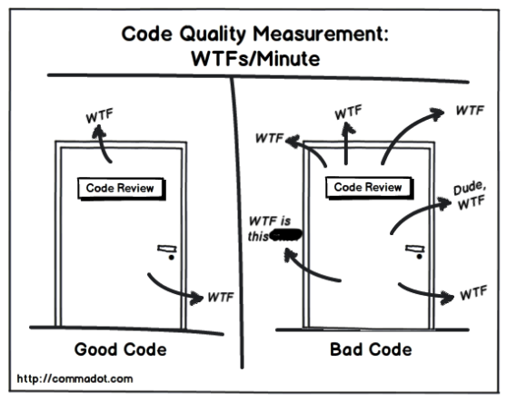

# Code Smells

* Son estructuras dentro del código
* Indican contravención de heurísticas o principios de diseño aceptadas por la comunidad
* Impactan negativamente la calidad del código
* No son bugs
* Es una indicación de la mala calidad del código. Si hay code smells, quien lea el código tendrá la sensación de que algo está mal

## Clean code

* **C**ohesive
* **L**oosely coupled
* **E**ncapsulated
* **A**ssertive
* **N**on-redundant

* Pero además: **legible**



SMELL ==! (CLEAN CODE)

## Code smells clásicos

* Duplicate Code
* Large Class
* Long Method
* Data Class
* Feature Envy
* Switch Statements

### Duplicate code

* El mismo código, o código muy similar, aparece en muchos lugares

  | Problemas |
  | -- |
  | Hace el código más largo de lo que necesita ser |
  | Es difícil de cambiar, difícil de mantener |
  | Un bug fix en un clone no es fácilmente propagado a los demás clones |

  ```c
  int bar() {
    int aux;
    return aux=0;
  }

  int bar() {
    int aux;

    return aux=0;
  }

  int bar2() {
    int a;
    return a=0;
  } 
  ```

### Large Class

* Una clase intenta hacer demasiado trabajo
  * Tiene muchas variables de instancia
  * Tiene muchos métodos

  | Problemas |
  | -- |
  | Indica un problema de diseño (baja cohesión) |
  | Algunos métodos pueden pertenecer a otras clases |
  | Generalmente tiene código duplicado |

### Long Method

* Un método tiene muchas líneas de código (LOC)
* Cúanto es muchas LOCs?
  * Más de 20? 30?
  * Mas de 5?
  * Depende del lenguaje

  | Problemas |
  | -- |
  | Cuanto más largo es un método, más difícil es entenderlo, cambiarlo y reusarlo |

### Data Class

* Una clase que sólo tiene variables públicas o getters/setters
  * getter/setter son métodos sin lógica (sin comportamiento/behavior)
* Actúa únicamente como contenedor de datos

  | Problemas |
  | -- |
  | En general sucede que otras clases tienen métodos con "envidia de atributo" |
  | Esto indica que esos métodos deberían estar en la "data class" |
  | Suele indicar que no hay delegación de responsabilidad o falta de abstracción |

### Feature Envy

* Un método en una clase usa principalmente los datos y métodos de otra clase para realizar su trabajo

  | Problemas |
  | -- |
  | Idealmente se prefiere que los datos y las acciones sobre los datos vivan en la misma clase |
  | "Feature Envy" indica que el método fue ubicado en la clase incorrecta |
  | Ejemplo: "if ((Today.year - person.birthDate.year) > 18  ) then ... "  |

### Switch Statements

* Cuando sentencias condicionales contienen lógica para diferentes tipos de objetos
* Señal de falta de delegación de responsabilidad y polimorfirmo

  | Problemas |
  | -- |
  | La misma estructura condicional aparece en muchos lugares |
  | La lógica deberia de moverse a cada clase manteniendo el polimorfismo |
