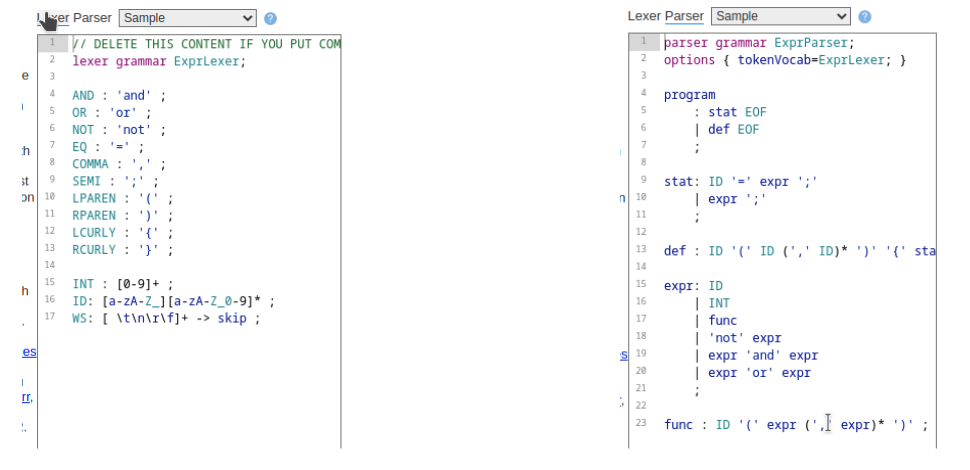
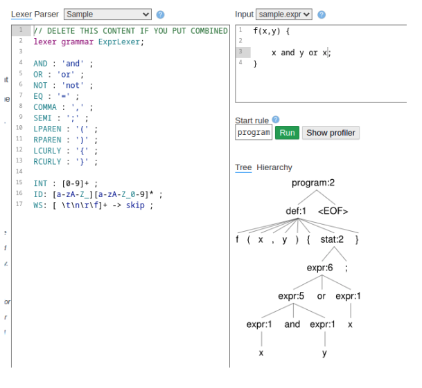

# ANTLR4

* ANTLR: ANother Tool for Language Recognition ("otra herramienta para reconocimiento de lenguajes")
* Proporciona un framework para construir scanners y parsers a partir de una gramática.
* Es un programa que determina si una palabra pertenece a dicho lenguaje (reconocedor), utilizando algoritmos LL(*) de parsing.
* Se puede usar para la construcción de lenguajes, herramientas y frameworks.
* Para una gramática, puede generar un parser que construya un árbol AST (árbol de sintaxis abstracta)
* Permite crear DSLs:
  * DSL: Domain Specific Language es un lenguaje especifico para un dominio o negocio
  * DSL: dominio + sintaxis + semántica
* [Sitio Web](https://tomassetti.me/antlr-mega-tutorial/)

## Instalación Windows

1. Instalar Java
1. Descargar ANTLR antlr-4.9.3-complete.jar desde la página oficial [ANTLR](https://www.antlr.org/download/) y guardarlo en una carpeta para librerías de terceros, Por ejemplo en C:\Javalib
1. Crear la variable de entorno CLASSPATH y agregar el path
    * C:\Javalib\antlr-4.9.3-complete.jar
1. Crear dos archivos batch de la siguiente manera:
    * antlr4.bat

    ```bat
    java org.antlr.v4.Tool %*
    ``

    * grun.bat

    ```bat
    @ECHO OFF
    SET TEST_CURRENT_DIR=%CLASSPATH:.;=%
    if "%TEST_CURRENT_DIR%" == "%CLASSPATH%" ( SET CLASSPATH=.;%CLASSPATH% )
    @ECHO ON
    java org.antlr.v4.gui.TestRig %*
    ```

1. Probar la conexión, ejecutando:

```sh
java org.antlr.v4.Tool
```

1. Se debe obtener la respuesta de ANTLR

```plain
ANTLR Parser Generator  Version 4.9.3 -o ___specify output directory where all output is generated -lib ___specify location of grammars, tokens files ...
```

## Instalación Linux

```sh
$cd /usr/local/lib
$sudo curl -O https://www.antlr.org/download/antlr-4.9-complete.jar
$export CLASSPATH=".:/usr/local/lib/antlr-4.9-complete.jar:$CLASSPATH"
$alias antlr4='java -Xmx500M -cp "/usr/local/lib/antlr-4.9-complete.jar:$CLASSPATH" org.antlr.v4.Tool'
$alias grun='java -Xmx500M -cp "/usr/local/lib/antlr-4.9-complete.jar:$CLASSPATH" org.antlr.v4.gui.TestRig'
```

## Uso

1. Definir una gramática dentro del archivo Hello.g4. Por ejemplo:

    ```antlr
    grammar Hello;

    r  : 'hello' ID;         // match keyword hello followed by an identifier
    
    ID : [a-z]+;             // match lower-case identifiers
    WS : [ \t\r\n]+ -> skip; // skip spaces, tabs, newlines
    ```

1. Ejecutar ANTLR y probar

    ```sh
    $ antlr4 Hello.g4
    $ javac Hello*.java

    $ grun Hello r -tree
    hello pepe
    ^D
    (r hello pepe)

    $ grun Hello r -gui
    hello pepe
    ^D
    ```

1. Luego de ejecutar y buildear la gramática, ANTLR genera los archivos java necesarios para su correcto funcionamiento.

## Ejemplo: Números enteros positivos

```grammar
grammar Numeros;

programa: expresion;
expresion : NUMERO;

NUMERO : [0-9]+;
WS : [ \t\r\n]+ -> skip;
```

## Ejemplo: Números enteros con signo

```grammar
grammar NumerosEnteros;

programa: expresion;
expresion : SIGNO? NUMERO;

SIGNO : ('+' | '-');
NUMERO : [0-9]+;
WS : [ \t\r\n]+ -> skip;
```

## Ejemplo: Expresiones aritméticas básicas

```grammar
grammar Math;

programa: expresion;
expresion : termino ((SUMA | RESTA) termino)*; 
termino : NUMERO | PARENTESISA expresion PARENTESISC;

SUMA : '+';
RESTA : '-';
NUMERO : [0-9]+;
PARENTESISA : '(';
PARENTESISC : ')';
WS : [ \t\r\n]+ -> skip;
```

```sh
$ antlr4 Math.g4
$ javac Math*.java
$ grun Math programa -gui
61+(98-3)+50
^D
```

## Ejemplo: Expresiones aritméticas avanzadas

```grammar
grammar Expr;

prog:   (expr NEWLINE)*;
expr:   expr ('*'|'/') expr
    |   expr ('+'|'-') expr
    |   INT
    |   '(' expr ')'
    ;
NEWLINE : [\r\n]+;
INT     : [0-9]+;
```

```sh
$ antlr4 Expr.g4
$ javac Expr*.java
$ grun Expr prog -gui
100+2*34
^D
```

## Ejemplo: Identificadores

```grammar
grammar Identificadores;

programa: identificador;
identificador : LETRA (LETRA | NUMERO)*;

NUMERO : [0-9]+;
LETRA : ([A-Z] | [a-z])+;

WS : [ \t\r\n]+ -> skip;
```

## Ejemplo: Control de paréntesis

```grammar
grammar Parentesis;

programa: expresion;
expresion : (PARENTESISA expresion PARENTESISC | LETRA)*;

LETRA : ([A-Z] | [a-z])+;
PARENTESISA : '(';
PARENTESISC : ')';

WS : [ \t\r\n]+ -> skip;
```

## Ejemplo; Sentencias if y while

```grammar
grammar Sentencias;
programa: BEGIN (sentenciaif | sentenciawhile) END;
sentenciaif : IF expresion THEN sentencia | IF expresion THEN sentencia ELSE sentencia;
sentenciawhile : WHILE expresion DO sentencia;
expresion: LETRA;
sentencia: LETRA;

BEGIN : 'begin';
END : 'end';
IF : 'if';
THEN : 'then';
ELSE : 'else';
WHILE : 'while';
DO : 'do';
LETRA : ([A-Z] | [a-z])+;
WS : [ \t\r\n]+ -> skip;
```

## Ejemplo: Lenguaje Gherkin

```grammar
grammar Gherkin;

story : feature? background? scenario*;

feature : feature_keyword feature_title feature_content;

feature_content : (NEWLINE SPACE SPACE line)* ;

feature_title : line ;

background : NEWLINE*? SPACE SPACE background_keyword (NEWLINE SPACE SPACE SPACE SPACE step_given);

scenario : NEWLINE*? scenario_keyword scenario_title (NEWLINE SPACE SPACE SPACE SPACE step)+ NEWLINE* examples*;

scenario_title : line ;

examples : examples_keyword NEWLINE+ SPACE SPACE examples_table ;

examples_table : table ;

table : table_row+;

table_row : (SPACE SPACE)? '|' cell+  NEWLINE?;

cell : (SPACE|TEXT)*? '|';

step: (step_given | step_when | step_then);

step_given : step_given_keyword step_line (NEWLINE SPACE SPACE step_connector_keyword step_line)*;
step_when : step_when_keyword step_line (NEWLINE SPACE SPACE step_connector_keyword step_line)*;
step_then : step_then_keyword step_line (NEWLINE SPACE SPACE step_connector_keyword step_line)*;

step_line : (step_text_line | step_table_line) ;

step_text_line : line ;

step_table_line : table ;

line : (SPACE|TEXT)*;

background_keyword : 'Background:' | 'Antecedentes:' ;

feature_keyword : 'Feature:' | 'Caracteristica:' ;

scenario_keyword : 'Scenario:' | 'Escenario:' ;

examples_keyword : 'Examples:' | 'Ejemplos:' ;

step_given_keyword : 'Given' | 'Dado' | 'Dada' | 'Dados' | 'Dadas' ;

step_when_keyword : 'When' | 'Cuando' ;

step_then_keyword : 'Then' | 'Entonces' ;

step_connector_keyword : 'And' | 'But' | 'Y' | 'E' | 'Pero' ; 

SPACE : ' ' | '\t';

NEWLINE : '\r'? '\n';

TEXT : (UPPERCASE_LETTER | LOWERCASE_LETTER | DIGIT | SYMBOL ) ;

fragment UPPERCASE_LETTER : 'A'..'Z' ;

fragment LOWERCASE_LETTER : 'a'..'z' ;

fragment DIGIT : '0'..'9' ;

fragment SYMBOL : '\u0021'..'\u0027'
    | '\u002a'..'\u002f'
    | '\u003a'..'\u0040'
    | '\u005e'..'\u0060'
    | '\u00a1'..'\u00FF'
    | '\u0152'..'\u0192'
    | '\u2013'..'\u2122'
    | '\u2190'..'\u21FF'
    | '\u2200'..'\u22FF'
    | '('..')'
    | '['..']'
    | '{'..'}' ;

COMMENT : '/*' .*? '*/' -> skip ;

LINE_COMMENT : '#-- ' .*? [\r\n] -> skip ;
```

## lab.antlr.org

* Es una herramienta para desarrollar y probar gramáticas





## Ejercicios

1. Visite la página [](http://lab.antlr.org/)
2. Seleccione
    * Lexer: Sample
    * Parser: Sample
    * Input: Sampe.expr
3. Corra ("run") el ejemplo e interprete el resultado
    * Cual es el problema?
    * Modifique el ejemplo (lexer o parser) para solucionar el problema
    * Modifique el ejemplo para agregar el operador lógico "xor"
