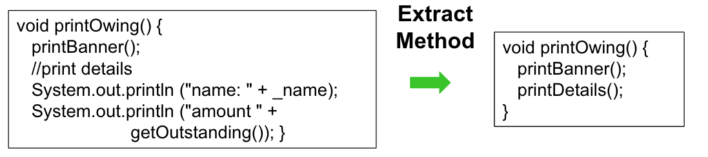
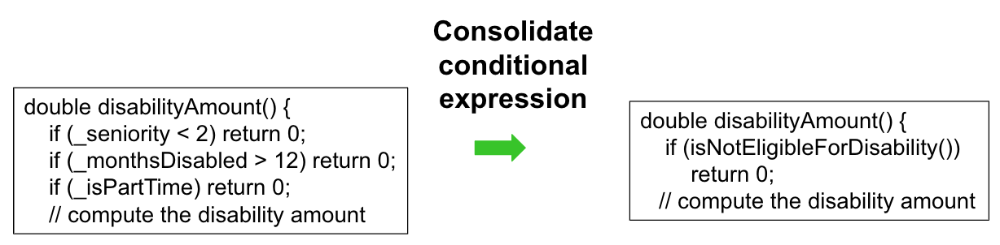
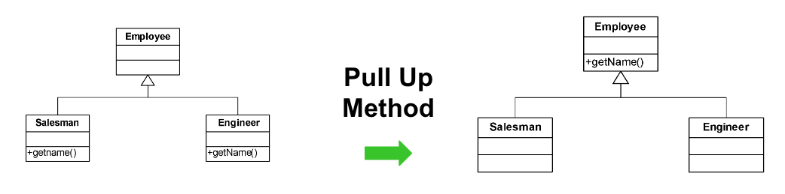

# Refactoring

* Transformación que preserva el comportamiento (Opdyke. 1992)
* Cambio realizado sobre la estructura interna del software para hacerlo más fácil de entender y menos costoso de modificar, sin cambiar el comportamiento observable (Fowler. 1999)
* Preservar el comportamiento
  * (Hace lo que hacía antes) & (No hace lo que no hacía antes)

## Refactoring al rescate

* Diseñar es difícil
* Mantener es caro
* Obtener código reusable requiere varias iteraciones
* Cambio y crecimiento continuo
* Calidad decae

## Ejemplos

## Proceso de refactoring

* Implica:
  * Simplificar lógicas complejas
  * Clarificar códigos
  * Eliminar duplicaciones
  * Eliminar code smells

* A través de cambios pequeños
  * Cambios pequeños son más fáciles y más seguros
  * Cada pequeño cambio pone en evidencia otros cambios necesarios

## Automatización del refactoring

* Refactoring manual es muy costoso: lleva mucho tiempo e induce a errores
* Tener una herramienta que realice refactoring automático permitiría aplicar muchos más cambios significativos en menos tiempo, lo cual nos permite ser mucho más ágiles en el desarrollo
* Es importante que la herramienta de refactoring está inmersa en la IDE para poder programar/refactorizar en un proceso continuo
