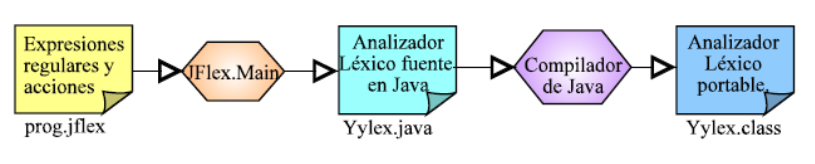

# Análisis Léxico (Scanner)

## Conceptos básicos

* Entrada: código fuente del LP que acepta el compilador.
* Salida: proporciona al parser los tokens.

### Token

* Es una agrupación de caracteres reconocidos por el scanner que constituyen los símbolos con los que se forman las sentencias del lenguaje.
* El scanner devuelve al parser el **nombre de ese símbolo junto con el valor del atributo**.

## El análisis léxico

* Una vez que empieza a leer el código fuente y reconoce el primer token, se lo envía al parser y este, en cuanto lo recibe, le pide el siguiente token para que siga reconociendo la entrada. Por tanto, los tokens son enviados al parser **bajo demanda**.
* Esta forma de funcionar se denomina **"dirigida por la sintaxis"** (parser driven).
* Si reconoce un identificador lo almacena en la tabla de símbolos, y posteriormente, si el parser reconoce que ese identificador lleva asociada **información de tipo** (entero, real, etc.) o de valor, también agrega esta información a la mencionada tabla.
* En cuanto al sistema de gestión de errores, se encarga de **detectar símbolos que no pertenezcan a la gramática** porque no encajen con ningún patrón. Bien porque haya caracteres inválidos, ejemplo @, o bien porque se escriban mal las palabras reservadas del lenguaje.

## Funciones del Scanner

1. Agrupar los caracteres que va leyendo uno a uno del programa fuente y formar los tokens.
1. Pasar los tokens válidos al parser.
1. Gestionar (abrir, leer y cerrar) el archivo que contiene el código fuente.
1. Eliminar comentarios, tabuladores, espacios en blanco, saltos de línea.
1. Relacionar los errores con las líneas del programa.
1. Expansión de macros.
1. Inclusión de archivos.
1. Reconocimientos de las directivas de compilación.
1. Introducir identificadores en la tabla de símbolos (opcional, pudiendo realizarse también por parte del parser).
1. Dependiendo de la naturaleza del código fuente, podría ser necesario realizar una pasada previa para examinarlo y posteriormente procesarlo.

## Definiciones básicas

* Token:
  * Es una agrupación de caracteres reconocidos por el scanner que constituyen los símbolos con los que se forman las sentencias del lenguaje y también se les denomina **componentes léxicos**
  * Constituyen los símbolos terminales de la gramática:
    * Palabras reservadas.
    * Identificadores.
    * Operadores y constantes.
    * Símbolos de puntuación y especiales.

* Lexema:
  * Es la secuencia de caracteres, ya agrupados, que coinciden con un determinado token, como por ejemplo el nombre de un identificador, o el valor de un número.
  * Un token puede tener uno o infinitos lexemas.

* Patrón:
  * Es la forma de describir los tipos de lexemas.
  * Esto se realiza utilizando expresiones regulares (ER).
  * Ejemplo: para los identificadores de variables en Java serían:
    * Letra ::= [a-zA-Z]
    * Dígito ::= [0-9]
    * Subrayado ::= [_]
    * Identificador ::= (Subrayado | Letra) (Subrayado | Letra | Dígito)*

### Ejemplos

| Token| Lexema | Patrón |
| -- | -- | -- |
| While | While | While |
| Const | const | const |
| Suma | + | + |
| Relación | <, <=, != | < \| <= \| != |
| Identificador | a, valor, b | [a-zA-Z]+ |
| Número | 5, 3, 25, 56 | [0-9]+(\.[0-9]+)? |

## ¿Cómo funciona el scanner?

* El scanner funciona bajo demanda del parser cuando le pide el siguiente token.
* A partir del archivo que contiene el código fuente va leyendo caracteres que almacena en un buffer de entrada.
* Cuando encuentra un carácter que no le sirve para construir un token válido, se para y envía los caracteres acumulados al parser y espera una nueva petición de lectura de éste.
* Cuando recibe una nueva petición del parser limpia el buffer y vuelve a leer el carácter donde paró la vez anterior (ya que eso no pertenecía al token que envió).
* Ejemplo:

  ```c
    int x; 
    main() {
    }
  ```

  | ENTRADA| BUFFER | ACCIÓN |
  | -- | -- | -- |
  | i | i | Leer otro caracter |
  | n | in | Leer otro caracter |
  | t | int | Leer otro caracter |
  | blanco | int | Enviar token y limpiar buffer |
  | x | x | Leer otro caracter |
  | ; | x | Enviar token y limpiar buffer |
  | ... | ... | ... |
  | Fin archivo | } | Enviar token y finalizar proceso de análisis |

## Diseño de un scanner

* Lo primero que tenemos que hacer para construir un scanner es diseñarlo, pudiendo usarse para ello una tabla o un diagrama de transición que representa los estados por los que va pasando el AF para reconocer un token.

### Tabla de transiciones

| f| a | b |
| -- | -- | -- |
| >q0 | q1 | - |
| *q1 | q0 | q1 |

* En las filas: los estados (q)
* En las columnas: los símbolos de entrada que pertenecen al alfabeto.

### Diagrama de transiciones (DT)

* Es una máquina de estados.
* Es parecida a un autómata finito determinista (AFD) pero con las siguientes diferencias:
  * El AFD sólo dice si la secuencia de caracteres pertenece al lenguaje o no y el DT debe leer la secuencia hasta completar un token y luego retornar ese token y dejar la entrada preparada para leer el siguiente token.
  * En un DT cada secuencia no determinada es un error. En los AFD podía haber estados especiales de error o estados que englobaban secuencias no admitidas en otros estados.
  * Los estados de aceptación de los DT deben ser finales.
  * En un DT, cuando se lea un carácter que no pertenezca a ninguna secuencia especificada, se debe ir a un estado especial final y volver el cursor de lectura de caracteres al carácter siguiente a la secuencia correcta leída.


## Ejemplo: Reconocimiento de identificadores

* Un identificador está formado por al menos una **letra mayúscula o minúscula** (ejemplo, a) seguida de forma opcional por mas letras o números (ejemplo, aa, a1, etc.).
* letra ::= [a-zA-Z]
* número ::= [0-9]
* otro ::= [otro]


## Ejemplo: Reconocimiento de números enteros sin signo, suma, incremento y producto

* Son válidos los siguientes lexemas: "01", "32", "+", "++", "*"
* Patrones:
  * ENTERO ::= ("0" | "1" | "2" | … | "9")+
  * SUMA ::= "+"
  * PRODUCTO ::= "*"
  * INCREMENTO ::= "++"
* Un asterisco en un estado de aceptación indica que el puntero que señala la lectura del siguiente símbolo (para reconocer el siguiente token) debe retroceder una unidad (si hubiera más asteriscos, retrocedería tantas unidades como asteriscos)
* Tras la llegada a un estado de aceptación, se le pasaría el token al parser y se esperaría una nueva petición de éste para comenzar otra vez en el estado 0 del autómata.


| Q | Dígito | + | \* | Otro | Token | Retroceso |
| -- | -- | -- | -- | -- | -- | -- |
| >q0 | q5 | q2 | q1 | Error | -  | - |
| *q1 | - | - | - | - | PRODUCTO | 0 |
| q2 | q3 | q4 | q3 | q3 | - | - |
| *q3 | - | - | - | - | SUMA | 1 |
| *q4 | - | - | - | - | INCREMENTO | 0 |
| q5 | q5 | q6 | q6 | q6 | - | - |
| *q6 | - | - | - | - | ENTERO | 1 |

* Una vez que se tiene la tabla, la implementación obtiene cada estado buscando el estado que hay en la fila correspondiente al estado actual y la entrada actual.
* Este proceso continúa hasta llegar a un estado de aceptación o uno de error.
* Si es de aceptación, devolverá el token junto con los caracteres acumulados hasta el momento.
* Si hay un retroceso en la fila, se retrocederá el cursor de selección de entrada tantas unidades como se indique en el retroceso.
* Se borra el buffer y se comienza en el estado 0.
* Si se ha llegado a un estado de error, se lanzará el error correspondiente.

* Suponer que se tiene  esta entrada: 25 + 5
* El autómata efectuará estos pasos: Estado=q0, Entrada=2, Estado=q5, Entrada=5, Estado=q5, Entrada=+, Estado=q6, Token=ENTERO, Lexema=25, Retroceso=1, Estado=q0, Entrada=+, Estado=q2, Entrada=5, Estado=q3, Token=SUMA, Lexema=+, Retroceso=1, Estado=q0, Entrada=5, Estado=q5 …

## Formas de implementar un scanner

* **Utilizando un generador de scaners**:
  * Son herramientas que a partir de las ER generan un programa que permite reconocer los tokens o componentes léxicos.
  * Suelen estar escritos en C (LEX) o Java (JFLEX)
  * Ventajas: comodidad y rapidez de desarrollo.
  * Desventajas: programas ineficientes y dificultad de mantenimiento del código generado.

* **Utilizando un lenguaje de alto nivel**:
  * A partir del diagrama de transiciones y del pseudocódigo correspondiente se programa un scanner.
  * Ventajas: eficiente y compacto (lo que facilita el mantenimiento)
  * Desventajas: hay que realizarlo todo a mano.

* **Utilizando un lenguaje de bajo nivel (ensamblador)**:
  * Ventajas: más eficiente y compacto.
  * Desventajas: más difícil de desarrollar.

## Errores léxicos

* Son detectados, cuando durante el proceso de reconocimiento de caracteres, los símbolos que tenemos en la entrada no concuerdan con ningún patrón. Hay que tener en cuenta que hay pocos errores detectables por el analizador léxico, entre ellos están:
  * **Nombres incorrectos de los identificadores**: se debe a que se utilizan caracteres inválidos para ese patrón, como por ejemplo un paréntesis, o se empieza por un número.
  * **Números incorrectos**: debido a que está escrito con caracteres inválidos (puntos en lugar de comas) o no está escrito correctamente.
  * **Palabras reservadas escritas incorrectamente**: se producen errores de ortografía. El problema aquí es cómo distingues entre un identificador y una variable reservada.
  * **Caracteres que no pertenecen al alfabeto del lenguaje**: Ejemplos: @, €, ¿, ?, ñ, etc.

## JFlex

* Es un generador de scanners.
* Generador de programas java diseñado para procesamiento léxico.
* Parte de un conjunto de reglas léxicas.
* JLex produce un programa llamado Yylex que reconoce las cadenas que cumplen dichas reglas.



* Lo primero es crear un archivo para el análisis léxico con JLex.
* Este archivo especificará los lexemas aceptables por el compilador.
* Por ejemplo, si se va a utilizar la sentencia while para los bucles pero no la for, el scanner dará un aviso de error si se encuentra una sentencia for.

### Uso de JFlex

* El formato de especificación es el siguiente:

  ```plain
  Código de Usuario
  %% {opciones y declaraciones}
  Directivas JFlex
  %% {reglas léxicas}
  Expresiones Regulares
  ```

* Los caracteres %% se usan para separar cada una de las secciones.

#### Código de usuario

* El  código auxiliar necesario para el traductor léxico.
* El contenido se copia tal y como aparece en la especificación, al principio del código fuente generado por JFlex.
* Se pone, por ejemplo, el package, las importaciones de clases que se podrían necesitar:

  ```plain
  import java_cup.runtime.Symbol;
  import java.io.*;
  ```

#### Opciones y declaraciones

* Opciones de código generado:

| Código | Descripción |
| -- | -- |
| %class nombre | Especifica el nombre de la clase generada como salida de JFlex |
| %line | Activa cuenta de líneas (yyline) |
| %column | Activa cuenta de columnas (yycolumn) |
| %standalone | Genera programa que acepta un archivo de entrada en línea de comando |
| %debug | Durante la ejecución muestra: nº línea de la especificación, lexema reconocido y acción ejecutada |
| %cup | Se le informa a JLex que se va a utilizar Cup |

* Código fuente específico:

| Código Fuente específico | Descripción |
| -- | -- |
| %{ ... %}  | Código copiado tal cual en la clase |
| %init{... %init} | Código copiado tal cual en el constructor de la clase |
| %eofval{ ... %eofval} | Código que se ejecutará cada vez que alcanzamos un final de archivo. Permiten especificar el token que devuelve el analizador léxico cuando se llega al final del archivo. Estas directivas encapsulan el código Java que se va a ejecutar cuando se invoque el método que proporciona el analizador léxico para producir el siguiente token (es decir, si se utiliza la directiva %cup, cuando se invoca el método next_token) y se ha llegado al final del archivo de entrada al analizador léxico. |

* Macros y estados:
  * Macros: definiciones regulares. Ejemplos:
    * DigitoHex = [0-9a-fA-F]
    * NumeroBinario = “b” [01]+
    * NumeroDecimal = [1-9][0-9]*
  * Estados: condicionan las reglas léxicas que se comprueban. Ejemplos:
    * %state nombre1, nombre2, ...
    * %xstate nombre3, nombre4, ...

#### Reglas léxicas

* Formato: expresión { ... acciones ...}
* Funcionamiento: Cuando se detecta un lexema que cumple el patrón definido en la expresión se ejecutan las acciones asociadas (código java).
* Metacaracteres: ? * + | () ^ $ . [ ] { } “ \
* Sean a y b expresiones válidas:

| ER | Significado |
| -- | -- |
| a \| b  | Unión |
| ab  | Concatenación |
| a*  | Repetición 0 o N veces |
| a+  | Repetición 1 o N veces (= a a*) |
| a?  | Opcionalidad |
| !a  | Negación |
| ~a  | Cualquier cosa que termine en a |
| { nombre }  | Utilización de una macro |
| "..."  | Cadena de caracteres |
| [...]  | Clases de caracteres |
| .  | Cualquier carácter excepto \n |
| [:letter:]  | Letras |
| [^...]  | Complementario de clases de caracteres |

* Ejemplo: identificadores que comiencen con la letra a o b y después tengan 0 o más letras a, b, o números del 0 al 9. Y además reconocería números.
  * Reconocería estos lexemas: a12, b, b0223, 1, 123, 102, 20, 1123
  * Daría errores para: c12, 01, ad, 12a

  ```plain
  import java_cup.runtime.Symbol;
  %%
  %public
  %class Prueba
  %standalone
  %%
  [a-b][a-b0-9]* {System.out.println("OK"); }
  \r|\n|\r\n {System.out.println("ENTER"); }
  [ \t\f] {System.out.println("ESPACIO"); }
  . {System.out.println("FAIL"); }
  ```

#### Funciones

| Función | Significado |
| -- | -- |
| yytext() | Devuelve el lexema reconocido |
| yylength() | Devuelve la longitud del lexema |
| yycharat(int n) | Devuelve el enésimo carácter del lexema reconocido |
| yypushback(int n) | Considera los n últimos caracteres del lexema reconocido como no procesados |

### Ejemplo JLex

  ```plain
  %%
  %class Scanner
  %standalone
  %line
  %column
  Digito = [0-9]
  Letra = [a-zA-Z]
  ID = {Letra}({Letra}|{Digito})*
  %% 
  {Digito} { System.out.println("[" + yyline + "," + yycolumn + "] DIGITO: " + yytext()); }
  {Letra}  { System.out.println("[" + yyline + "," + yycolumn + "] LETRA: " + yytext()); }
  {ID}     { System.out.println("[" + yyline + "," + yycolumn + "] ID: " + yytext()); }
  .        { System.out.println("[" + yyline + "," + yycolumn + "] OTRO: " + yytext()); }
  ```

## Ejercicios

1. Diseñar un DT para reconocer los siguientes componentes léxicos:
    * LETRAS: cualquier secuencia de una o más letras.
    * ENTERO: cualquier secuencia de uno o más números (si tiene más de un número no deberá comenzar por 0).
    * ASIGNAR: la secuencia =.
    * SUMAR: la secuencia +.
    * RESTAR: la secuencia -.
    * IMPRIMIR: la palabra reservada print.

1. Para el lenguaje generado por la expresión regular  (a | b)* abb
    1. Crear el DT.
    1. Generar la tabla de transiciones.
    1. Escribir un programa en Java para implementar la tabla.

1. Escriba un analizador léxico que:
    1. Sustituya las apariciones de un número par escrito en notación binaria por la cadena “BINARIO_PAR”.

        ```plain
        %%
        %class Ejer
        %standalone
        %line
        %column
        BINARIO_PAR = ([0-1]*)0
        BINARIO_NO_PAR = ([0-1]*)1
        %% 
        {BINARIO_PAR} {System.out.print("BINARIO_PAR ");}
        {BINARIO_NO_PAR} {System.out.print(yytext()+" ");}
        (" "|\t|\r)+ {}
        (\n) {System.out.println(" ");}
        ```

    1. Sustituya las cadenas casa, camisa y carcasa que figuran en un texto por la cadena “CA_SA”.

        ```plain
        CA_SA = "ca"("rca"|"mi")?"sa"
        %% 
        {CA_SA} {System.out.print("CA_SA");}
        (\n) {System.out.println(" ");}
        .    {System.out.print(yytext());}
        ```

    1. Reduzca a un único espacio en blanco todas las secuencias de espacios en blanco y tabuladores de un texto.

        ```plain
        ESPACIOS = [" " | \t]+
        %% 
        {ESPACIOS} {System.out.print(" ");}
        (\n) {}
        ```

    1. Suprima los comentarios de línea de un texto (desde un # hasta el fin de la línea).

        ```plain
        Comentario = #(.)*
        %% 
        {Comentario} {System.out.print("");}
        . {System.out.print(yytext());}
        ```

    1. Inserte un * delante y detrás de cada carácter + que figura en un texto.

        ```plain
        %% 
        "+" {System.out.print("*" + yytext() + "*");}
        ```

    1. Enmarca entre corchetes el carácter que precede a cada uno de los puntos que figuran en un texto.

        ```plain
        CORCHETE = (.)"."
        %% 
        {CORCHETE} {System.out.print("["+yycharat(0)+"].");}
        ```

    1. Sustituya las apariciones de un número de la semana (de 1 a 7) por su correspondiente nombre de día.
    1. Sustituya los operadores de suma +, resta -, producto * y división / y potencia ^ por la cadena "OPERADOR“.
    1. Sustituya las apariciones de un número escrito en base hexadecimal por la cadena "HEXADECIMAL".
    1. Escriba en mayúsculas todas las palabras de un texto que comienzan por mayúsculas. (Considere que una palabra es una secuencia constituida por letras minúsculas o mayúsculas).
    1. Sustituya todas las cadenas de un texto por el contenido de la cadena sin las comillas (Por ejemplo: "hola" sería sustituido por hola). Se define como cadena cualquier texto enmarcado entre comillas dobles con la condición de que en su contenido no figuran ni comillas dobles ni saltos de línea.
    1. Sustituya las apariciones de número reales en notación científica por la cadena "REAL". Se admiten como cadenas (lexemas): -3.4 .4 3.E10 .6e-2. No se admiten las siguientes: 45 4.6E .
    1. Sustituya las expresiones horarias que encajan o bien con el patrón HH:MM o bien con el patrón H:MM por la cadena "HORA". Tenga en cuenta que las horas deben ser correctas. Por ejemplo: 29:80 no sería una hora correcta.
    1. Sustituye las palabras de un texto que empiezan por minúsculas por la cadena MINÚSCULA y las palabras que empiecen por mayúsculas por la cadena MAYÚSCULA.
    1. Para representar fechas existen dos formatos: el americano (AAAA/DD/MM) y el europeo (DD/MM/AAAA). Escriba un analizador léxico que imprima todas las fechas de un texto que se ajusten a uno de dichos formatos indicando además qué formato fue usado (Ignore la problemática relacionada con los años bisiestos).
    1. Sustituya cada identificador de un texto por la cadena IDENT salvo que el identificador sea una de las palabras reservadas: If, Then o Else. En este último caso deberá imprimirse respectivamente las cadenas IF, THEN y ELSE. Las anteriores palabras reservadas no son sensibles a la capitalización, es decir, podrán aparecer mezcladas arbitrariamente letras minúsculas y mayúsculas. Por ejemplo, para la palabra reservada Else se admiten también las formas ELSe o eLsE.
    1. Distinga entre los siguientes tipos de números: entero (INT) entero largo (LONG) y real (FLOAT). Los enteros largos son enteros terminados con una letra l mayúscula o minúscula. Los reales deben incluir de forma obligatoria parte entera y parte decimal separadas por un punto.
    1. Reconozca “Identificadores de cualquier longitud que comience con a y contenga a, b o c. No pueden terminar con c y además no pueden contener dos c seguidas.
    1. Reconozca “Identificadores sobre el alfabeto {a,b,c} que tienen por lo menos tres letras”.
    1. Reconozca “Identificadores sobre el alfabeto {%, &} cuyas palabras verificar las siguientes restricciones: 1) Si una palabra tiene menos de cinco &, entonces tiene un número par de &. 2) Si una palabra tiene cinco & o más, entonces contiene un número impar de &. 3) Cualquier palabra contiene al menos un &.
    1. Una cadena comando es el nombre del comando seguido de uno o más espacios en blanco, y a continuación una lista de parámetros que puede ser vacía. Un comando es una secuencia no vacía de cadenas comando separadas por un delimitador. Un delimitador es un elemento del conjunto {. , ;}. Un nombre comienza con una letra y sigue con cero o más letras o dígitos. La lista de parámetros es una secuencia de uno o más nombres separados por uno o más espacios en blanco. Opciones: Expresión regular o gramática regular o autómata finito determinista que reconozca las palabras de dicho lenguaje. Se acepta cerradura positiva. Usar como símbolo de blanco la b tachada.
