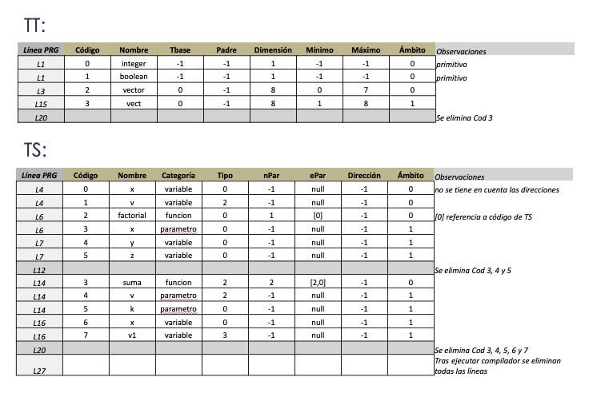

# Tabla de Tipos y de Símbolos

* Normalmente, los LP mantienen tipos primitivos de datos y permiten crear nuevos tipos a partir de los primitivos.
* También es generalizado el empleo de variables que pertenecen a alguno de los tipos primitivos o definidos por el usuario.
* Aparte de las variables, suelen utilizarse subprogramas.
* Tanto las variables como los subprogramas son generalmente creados por el programador y se les suele llamar símbolos.
* Por lo tanto, se deben mantener básicamente 2 estructuras de información: referentes a los tipos del lenguaje y a los símbolos del mismo.
* Hay muchas maneras de mantener esa información, pero lo más utilizado es mediante dos tablas, una para los tipos y otra para los símbolos.
* Tanto la tabla o tablas de tipos como la o las de símbolos deben estar accesibles durante todo el proceso de creación del compilador ya que las diferentes fases harán uso de estas tablas (en especial las fases de análisis sintáctico y semántico).

## Tabla de tipos (TT)

* Una de las tareas del análisis semántico, es comprobar que los tipos de las diferentes variables, funciones o parámetros sean los adecuados conforme a la estructura del compilador que se esté creando.
* Por lo que una gestión de los tipos es esencial para hacer las comprobaciones semánticas necesarias.
* Generalmente, los LP más utilizados mantienen una serie de tipos primitivos o predefinidos de datos y además permiten que el programador cree sus propios tipos de datos, basados en los primitivos.
* Por lo tanto, la tabla o tablas de tipos deben inicializarse con los tipos primitivos del LP del que se vaya a crear el compilador.
* Se habla de tabla o tablas porque hay varias posibilidades de implementar la tabla de tipos. Una de ellas es mantener una tabla de tipos por cada ámbito de ejecución.
* Por ejemplo, suponer que se tiene un programa en Pascal:

```pascal
program p;
  type tipo0 = array[0..3] of boolean;
  procedure pp;
    type tipo1 = array[0..5] of integer;
  begin
  end;
begin
end.
```

* Aquí hay dos ámbitos:
  * el del programa principal
  * el del procedimiento.
* Desde dentro del procedimiento se puede acceder a las variables que sean del tipo del programa principal, pero desde el programa principal no se puede acceder a los tipos de dentro del procedimiento.
* Como en el proceso de compilación serán utilizadas varias tablas de tipos (generalmente), es muy común utilizar una pila de tablas de tipos e ir apilando y desapilando tablas según se entre o salga de los ámbitos.
* Pero también es posible utilizar una sola TT con información sobre el ámbito al que pertenece e ir eliminando entradas o agregandolas según se salga o entre en los ámbitos (esto mismo se puede hacer para la tabla de símbolos).
* Debido a esto, se puede utilizar una TT para cada ámbito y luego destruirla cuando se sale del ámbito.
* Como el acceso a la TT suele ser muy repetido, se deben utilizar estructuras eficientes a la hora de implementarla.
* Dependiendo del diseño del compilador, es posible que se permita redefinir tipos o símbolos con el mismo nombre dentro de ámbitos diferentes. Pero esto depende del diseñador del compilador.
* Cuando se permite redefinir tipos o símbolos, a la hora de buscar un tipo o símbolo para por ejemplo ver si el tipo devuelto por una función es compatible con un tipo concreto, se debe buscar el tipo o símbolo partiendo del ámbito más interno (el más cercano) y así sucesivamente hasta el ámbito más global o externo.
* Para implementar las tablas de tipos y símbolos, se suelen emplear tablas hash, que son las que tienen un tiempo de acceso más reducido (ya que habrá que realizar muchas lecturas a lo largo del proceso de compilación).

### Implementación de TT

* Generalmente, las TT contienen información del nombre del tipo, el tamaño, el padre si se trata de un tipo compuesto y alguna información más dependiendo del tipo de compilador de que se trate.
* Como en una misma TT no se debe repetir el mismo tipo, la TT suele estar ordenada por el nombre del tipo.
* Si el compilador no admite ámbitos anidados, con una sola TT es suficiente.
* Los campos mínimos necesarios que debe guardar una TT son:
  * **Nombre**: nombre o identificador del tipo. Por ejemplo, int.
  * **TipoBase**: se utiliza para tipos compuestos. Por ejemplo, String[] tipo, el tipo base sería String.
  * **Padre**: es el tipo en el caso de declarar registros. Por ejemplo, el padre del campo x sería el tipo reg. type reg = record x: integer; y: boolean; end;
  * **Dimensión**: número de elementos de un tipo básico que están contenido en un tipo compuesto. Por ejemplo, para los tipos básicos, la dimensión sería 1, pero para un vector de 10 enteros, la dimensión sería 10.
  * **Mínimo**: se utiliza para el caso de la definición de vectores. Por ejemplo, en C sería 0, pero en Pascal, lo define el programador.
  * **Máximo**: lo mismo que en caso anterior, pero para el índice máximo. Por ejemplo, en C sería la dimensión del vector menos 1, pero en Pascal, lo define el programador.
  * **Ámbito**: si se va a utilizar una sola tabla para la gestión de tipos en diferentes ámbitos, se pone aquí el ámbito en el que está definido el tipo.
* Otro aspecto a tener en cuenta a la hora de implementar la TT es que se debe saber si el lenguaje es sensible a mayúsculas o no.

### Ejemplo de Implementación de una TT única

* Suponer: LP es sensible a mayúsculas.
* Suponer: Los tipos básico o predefinidos del LP se suelen agregar al crearse la tabla de tipos: int y boolean.

```pascal
1:  program p;
2:    type vector = array[0..9] of integer;
3:    type registro = record
4:      x : integer;
5:      y : boolean;
6:     end;
7:     procedure p1;
8:      type vector = array[0..8] of boolean;
9:      type r1 = record
10:       y : integer;
11:       z : integer;
12:     end;
13:    begin
14:    end;
15: begin
16: end.
```

1. Inicialmente, se agregan los tipos básicos a la TT:

| Cod | Nombre | TipoBase | Padre | Dimensión | Mínimo | Máximo | Ámbito |
| -- | -- | -- | -- | -- | -- | -- | -- |
| 0 | integer | -1 | -1 | 1 | -1 | -1 | 0 |
| 1 | boolean | -1 | -1 | 1 | -1 | -1 | 0 |

1. Se procesa la línea 1, luego la 2:

| Cod | Nombre | TipoBase | Padre | Dimensión | Mínimo | Máximo | Ámbito |
| -- | -- | -- | -- | -- | -- | -- | -- |
| 0 | integer | -1 | -1 | 1 | -1 | -1 | 0 |
| 1 | boolean | -1 | -1 | 1 | -1 | -1 | 0 |
| 2 | vector | 0 | -1 | 10 | 0 | 9 | 0 |

1. Se procesa la línea 3:

| Cod | Nombre | TipoBase | Padre | Dimensión | Mínimo | Máximo | Ámbito |
| -- | -- | -- | -- | -- | -- | -- | -- |
| 0 | integer | -1 | -1 | 1 | -1 | -1 | 0 |
| 1 | boolean | -1 | -1 | 1 | -1 | -1 | 0 |
| 2 | vector | 0 | -1 | 10 | 0 | 9 | 0 |
| 3 | registro | -1 | -1 | **-1** | -1 | -1 | 0 |

1. Se procesa la línea 4 y 5:

| Cod | Nombre | TipoBase | Padre | Dimensión | Mínimo | Máximo | Ámbito |
| -- | -- | -- | -- | -- | -- | -- | -- |
| 0 | integer | -1 | -1 | 1 | -1 | -1 | 0 |
| 1 | boolean | -1 | -1 | 1 | -1 | -1 | 0 |
| 2 | vector | 0 | -1 | 10 | 0 | 9 | 0 |
| 3 | registro | -1 | -1 | **2** | -1 | -1 | 0 |
| 4 | x | 0 | 3 | 1 | -1 | -1 | 0 |
| 5 | y | 1 | 3 | 1 | -1 | -1 | 0 |

1. Se procesa la línea 6, 7 y 8:

| Cod | Nombre | TipoBase | Padre | Dimensión | Mínimo | Máximo | Ámbito |
| -- | -- | -- | -- | -- | -- | -- | -- |
| 0 | integer | -1 | -1 | 1 | -1 | -1 | 0 |
| 1 | boolean | -1 | -1 | 1 | -1 | -1 | 0 |
| 2 | vector | 0 | -1 | 10 | 0 | 9 | 0 |
| 3 | registro | -1 | -1 | **2** | -1 | -1 | 0 |
| 4 | x | 0 | 3 | 1 | -1 | -1 | 0 |
| 5 | y | 1 | 3 | 1 | -1 | -1 | 0 |
| 6 | vector | 1 | -1 | 9 | 0 | 8 | **1** |

1. Se procesa la línea 9:

| Cod | Nombre | TipoBase | Padre | Dimensión | Mínimo | Máximo | Ámbito |
| -- | -- | -- | -- | -- | -- | -- | -- |
| 0 | integer | -1 | -1 | 1 | -1 | -1 | 0 |
| 1 | boolean | -1 | -1 | 1 | -1 | -1 | 0 |
| 2 | vector | 0 | -1 | 10 | 0 | 9 | 0 |
| 3 | registro | -1 | -1 | **2** | -1 | -1 | 0 |
| 4 | x | 0 | 3 | 1 | -1 | -1 | 0 |
| 5 | y | 1 | 3 | 1 | -1 | -1 | 0 |
| 6 | vector | 1 | -1 | 9 | 0 | 8 | **1** |
| 7 | r1 | -1 | -1 | -1 | -1 | -1 | **1** |

1. Se procesa la línea 10 y 11:

| Cod | Nombre | TipoBase | Padre | Dimensión | Mínimo | Máximo | Ámbito |
| -- | -- | -- | -- | -- | -- | -- | -- |
| 0 | integer | -1 | -1 | 1 | -1 | -1 | 0 |
| 1 | boolean | -1 | -1 | 1 | -1 | -1 | 0 |
| 2 | vector | 0 | -1 | 10 | 0 | 9 | 0 |
| 3 | registro | -1 | -1 | **2** | -1 | -1 | 0 |
| 4 | x | 0 | 3 | 1 | -1 | -1 | 0 |
| 5 | y | 1 | 3 | 1 | -1 | -1 | 0 |
| 6 | vector | 1 | -1 | 9 | 0 | 8 | **1** |
| 7 | r1 | -1 | -1 | **2** | -1 | -1 | **1** |
| 8 | y | 0 | 7 | 1 | -1 | -1 | **1** |
| 9 | z | 0 | 7 | 1 | -1 | -1 | **1** |

1. Se procesa la línea 12 y 13: la TT no cambia.
1. Se procesa la línea 14: se termina el procedimiento, se elimina el ámbito y, por tanto, los tipos que están en él.

| Cod | Nombre | TipoBase | Padre | Dimensión | Mínimo | Máximo | Ámbito |
| -- | -- | -- | -- | -- | -- | -- | -- |
| 0 | integer | -1 | -1 | 1 | -1 | -1 | 0 |
| 1 | boolean | -1 | -1 | 1 | -1 | -1 | 0 |
| 2 | vector | 0 | -1 | 10 | 0 | 9 | 0 |
| 3 | registro | -1 | -1 | **2** | -1 | -1 | 0 |
| 4 | x | 0 | 3 | 1 | -1 | -1 | 0 |
| 5 | y | 1 | 3 | 1 | -1 | -1 | 0 |

1. Se procesa la línea 15: la TT no cambia.
1. Se procesa la línea 16: la última línea del programa, ya no se necesita la TT y por lo tanto se la puede eliminar.

| Cod | Nombre | TipoBase | Padre | Dimensión | Mínimo | Máximo | Ámbito |
| -- | -- | -- | -- | -- | -- | -- | -- |

## Tabla de Símbolos (TS)

* La TS tiene una estructura parecida a la de tipos, pero su sentido es diferente.
* Cuando se habla de símbolos en un programa se refiere a las constantes, las variables, los subprogramas y los parámetros de los subprogramas.
* La TS mantiene una gestión de ámbitos. Por lo tanto, hay también al menos dos implementaciones posibles para la TS, con una sola tabla o con una pila de tablas.
* En cuanto a la información que hay que guardar en la TS no es la misma que en la de tipos ya que el contenido de los símbolos en un programa concreto hay que guardarlos en algún lugar de la memoria de la computadora. Es decir, en tiempo de compilación, se mantiene la TT y TS en memoria, pero en tiempo de ejecución, sólo son los símbolos los que se guardan en la memoria que ocupa el programa compilado.
* Los símbolos ocupan memoria en el programa compilado ya que ellos son los contenedores de la información que se procesa.
* Generalmente, la manera de guardar información de los símbolos es en la memoria de la computadora donde corre el programa compilado. Por lo tanto, los símbolos se guardan en direcciones de memoria. Es por ello que uno de los campos de cada símbolo en la TS es una dirección de memoria donde se guardará el valor del símbolo (ese valor puede cambiar a lo largo de la ejecución del programa, pero su dirección suele ser fija).
* En cuanto a los subprogramas, son representados también por símbolos (el nombre del subprograma) pero no guardan su valor en una dirección de memoria.
* Como se hizo en la TT, es habitual poner un código único a cada símbolo para referirse a él en lugar de con su nombre. Los campos básicos de la TS son:
  * **Nombre**: indica el nombre del símbolo. Por ejemplo, el nombre de una variable, el nombre de una función, etc.
  * **Categoría**: indica si es una variable, una función, un procedimiento, una constante o un parámetro.
  * **Tipo**: es el tipo al que pertenece el símbolo (de entre los tipos de la tabla de tipos). En el caso de los subprogramas es el tipo que devuelve (si no devuelve ninguno, este campo será nulo o generalmente tendrá el valor -1).
  * **NumeroParametros**: sólo tiene significado si se trata del símbolo de un subprograma. En otro caso se mantiene nulo o -1.
  * **ListaDeParametros**: debe contener una lista con al menos los tipos de los parámetros de un subprograma (para poder comprobar si cuando se hace una llamada a un subprograma coinciden los tipos de los parámetros).
  * **Dirección**: indica la dirección en memoria (absoluta o relativa) donde estará almacenado el valor del símbolo (si tiene valor). Si el símbolo pertenece a un tipo estructurado, esta dirección guardará el contenido del primer elemento y las sucesivas los demás elementos.
  * **Ámbito**: este campo sólo es necesario si la implementación va a ser sólo con una TS. Si va a implementarse como una pila de tablas, este campo es innecesario.

### Ejemplo de Implementación de una TS única

* En cuanto al funcionamiento de la tabla de símbolos y la de tipos es el mismo. Sea el siguiente programa en Pascal:

```pascal
1: program p;
2:  type vector = array[5..10] of integer;
3:  var v : vector; x : integer;
4: begin
5:   v[7] := 15;
6:   x := v[7];
7: end.
```

1. Se procesa la línea 1:
    * TT

    | Cod | Nombre | TipoBase | Padre | Dimensión | Mínimo | Máximo | Ámbito |
    | -- | -- | -- | -- | -- | -- | -- | -- |
    | 0 | integer | -1 | -1 | 1 | -1 | -1 | 0 |
    | 1 | boolean | -1 | -1 | 1 | -1 | -1 | 0 |

    * TS

    | Cod | Nombre | Categoria | Tipo | NumPar | ListaPar | Dirección | Ámbito |
    | -- | -- | -- | -- | -- | -- | -- | -- |

1. Se procesa la línea 2:
    * TT

    | Cod | Nombre | TipoBase | Padre | Dimensión | Mínimo | Máximo | Ámbito |
    | -- | -- | -- | -- | -- | -- | -- | -- |
    | 0 | integer | -1 | -1 | 1 | -1 | -1 | 0 |
    | 1 | boolean | -1 | -1 | 1 | -1 | -1 | 0 |
    | 2 | vector | 0 | -1 | 6 | 5 | 10 | 0 |

    * TS

    | Cod | Nombre | Categoria | Tipo | NumPar | ListaPar | Dirección | Ámbito |
    | -- | -- | -- | -- | -- | -- | -- | -- |

1. Se procesa la línea 3:
    * TT

    | Cod | Nombre | TipoBase | Padre | Dimensión | Mínimo | Máximo | Ámbito |
    | -- | -- | -- | -- | -- | -- | -- | -- |
    | 0 | integer | -1 | -1 | 1 | -1 | -1 | 0 |
    | 1 | boolean | -1 | -1 | 1 | -1 | -1 | 0 |
    | 2 | vector | 0 | -1 | 6 | 5 | 10 | 0 |

    * TS

    | Cod | Nombre | Categoria | Tipo | NumPar | ListaPar | Dirección | Ámbito |
    | -- | -- | -- | -- | -- | -- | -- | -- |
    | 0 | v | variable | 2 | -1 | null | **9000** | 0 |
    | 1 | x | variable | 0 | -1 | null | **9006** | 0 |

1. Se procesa la línea 4 y 5: el contenido de las 2 tablas es el mismo:
    * TT

    | Cod | Nombre | TipoBase | Padre | Dimensión | Mínimo | Máximo | Ámbito |
    | -- | -- | -- | -- | -- | -- | -- | -- |
    | 0 | integer | -1 | -1 | 1 | -1 | -1 | 0 |
    | 1 | boolean | -1 | -1 | 1 | -1 | -1 | 0 |
    | 2 | vector | 0 | -1 | 6 | 5 | 10 | 0 |

    * TS

    | Cod | Nombre | Categoria | Tipo | NumPar | ListaPar | Dirección | Ámbito |
    | -- | -- | -- | -- | -- | -- | -- | -- |
    | 0 | v | variable | 2 | -1 | null | **9000** | 0 |
    | 1 | x | variable | 0 | -1 | null | **9006** | 0 |

    * El contenido de la memoria ha cambiado ya que se la ha asignado un valor al elemento v[7]. Para calcular la dirección donde hay que poner el valor 15, se hacen los siguientes cálculos:

      ```plain
      dir(v, 7) = dir(v, 0) + dir (v, 7) = 9000 + (7 -5) = 9002
      ```

    * Es decir, en la posición de memoria 9002 se guardará el valor 15.

1. Se procesa la línea 6. Se llena la dirección donde está la variable x con el valor que hay en la dirección donde está v[7]. Es decir, la dirección 9006 se llena con el valor que hay en la dirección 9002.

## Ejercicios

1. Dado el siguiente programa en un sublenguaje de Pascal:
    * Suponer que este sublenguaje tiene dos tipos predefinidos: integer y boolean.
    * Suponer que es sensible a las mayúsculas.
    * Mostrar el estado de la tabla de tipos y de símbolos tras procesar cada una de las líneas.

```pascal
1: program p;
2: 
3:  type vector = array[0..7] of integer;
4:  var x : integer;   v : vector;
5: 
6:  function factorial (x: integer): integer
7:    var y, z : integer;
8:   begin
9:    y := 1;
10:   for z := 1 to x do y := y * z;
11:   factorial := y;
12:  end;
13: 
14:  function suma (v: vector; k: integer): vector
15:   type vect = array[1..8] of integer;
16:   var x: integer;   v1: vect;
17:  begin
18:   for x := 0 to k do v1[x+1] := v[x];
19:   suma := v1;
20:  end;
21: 
22: begin
23:   x := 5:
24:   x := factorial(x);
25:   for x := 0 to 7 do v[x] := x;
26:   v := suma(v, x);
27: end.
```


